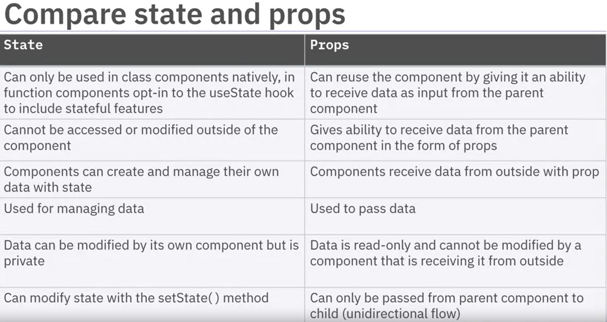

## Week 1

### Course Introduction

React is a framework for building client-side dynamic web applications. It is an efficient, flexible JavaScript library for building user interfaces. React uses a special markup language called JSX.

### Introduction to Frontend Frameworks and React

Front-end frameworks are used to create a dynamic client that can connect to the server. These frameworks are made available through open-source libraries which can be used as a part of the hypertext markup language (HTML), JavaScript, and cascading style sheets (CSS) in the browser.

Angular is an open-source framework from Google that can be used in any HTML by including the library. It is based on HTML and JavaScript, and it is easy to implement. To make HTML dynamic, Angular uses directives. All the directives are available to the HTML where the library is included. HTML uses Angular with model-bind directives. The input component is used as a model to which the label component is bound.

Vue is uses a virtual document object model (DOM). The HTML is considered as an entire object. As it is very lightweight, it renders fast. The attributes of the Vue object are similar to those of Angular, and binding is available.

React is a framework for building client-side dynamic web applications. React uses dynamic data binding and a virtual DOM to extend HTML syntax and to eliminate the need for code that keeps the user interface (UI) elements synchronized with the application state.

React uses a special markup language called JavaScript XML (JSX) which resembles HTML. JSX can be compiled and interpreted as JavaScript by Babel, a special in-memory tool. JSX is embedded inside special script tags where the type attribute specifies the content that requires Babel.

Three important packages that you use to build React applications are React package, ReactDOM package, and Babel package. The React package holds the React source for components and their states and properties. The ReactDOM package is the glue between React and the DOM. And Babel is the module which is available in most modern browsers. It is used to compile and interpret the JSX.

### Introduction to ES6

ES is short for EcmaScript. Ecma is a standards organization that creates a wide range of global information and communications technology standards. JavaScript adheres to Ecma’s specification ES6, which came out in 2015.

In JavaScript, the main changes are let, const, arrow functions, promises, and class.

- A `var` has global scope.
- `let` allows you to restrict the scope of variables within the block where they are declared (called "local scope.")
- `const` allows you to declare constants whose values cannot be changed.
- Arrow functions allow you to declare functions the same way that you declare variables.

```js
// older version
function sayHello() {
  console.log("ES5 - Hello World!");
}

// newer version
const sayHello = () => console.log("ES6 - Hello World!");
```

Arrow functions are called like normal functions. They can also be passed as parameters for callbacks. They can return a data type or an object.

```js
// different function types

// takes one parameter therefore brackets are not required; since there is return, curly brackets are required.
const oneParamArrowFunc = (name) => {
  return "hello " + name;
};

const twoParamsArrowFuncWithoutReturn = (first, second) =>
  console.log("Hello " + first + " " + second);

const twoParamsArrowFuncWithReturn = (first, second) => {
  return "Hello " + first + " " + second;
};

const twoParamsArrowFuncsArrowFunc = (first, second) => {
  const greeting = "hello ";
  return greetings + " " + first + " " + second;
};
```

The promise object represents the eventual completion of an asynchronous operation and its return value. When you invoke an asynchronous operation, a promise is in a pending state. When the operation executes successfully, the promise is said to be fulfilled. When the operation fails, the promise is said to be rejected.

```js
// without Promise constructor
let promiseArgument = (resolve, reject) => {
  setTimeout(() => {
    let currTime = new Date().getTime();
    if (currTime % 2 === 0) {
      resolve("Success!");
    } else {
      reject("Failed!");
    }
  }, 2000);
};
let myPromise = new Promise(promiseArgument);

// with Promise constructor
let myPromise = new Promise((resolve, reject) => {
    setTimeout(() => {
        let currTime = new Date().getTime();
        if (currTime % 2 === 0) {
            resolve("Success!");
    } else {
      reject("Failed!");
    }, 2000)
})
```

Object-oriented programming was made feasible in JavaScript with the introduction of class. Class is a template or blueprint for creating objects. Classes in JavaScript are built on prototypes. Prototype is a property of all JavaScript objects, including functions. A function can be used to create an object instance. But not all object-oriented programming concepts are available with function prototypes.

```js
function Person(name, age) {
  this.name = name;
  this.age = age;
  return this;
}

let person1 = Person("some", 20);
console.log(person1); //will print the entire prototype of the person1 object
console.log(person1.name);
console.log(person1.age);
```

Class can have a constructor, which is a method that is called when you want to create an object of class.

```js
class Rectangle {
  constructor(height, width) {
    this.height = height;
    this.width = width;
    console.log("something");
  }
}

let myRect = new Rectangle(10, 20);
```

In JavaScript ES6, a class can inherit from another class. The class that is inheriting one other class is called the subclass. The superclass is the class being inherited by the subclass. The subclass inherits all the attributes and methods of the superclass. React components use inheritance to build user-defined components. The subclass has a special privilege to call the superclass constructor with the super() method call.

```js
class Square extends Rectangle {
  constructor(height, width) {
    if (height === width) {
      super(height, width);
    } else {
      super(height, height);
    }
  }
}
```

### Introduction to TypeScript

TypeScript is a superset of JavaScript, meaning all JavaScript is TypeScript, but not all TypeScript is JavaScript.

React allows you to choose whether to use either JavaScript or TypeScript.

TypeScript is a compiled language that supports type-checking. TypeScript is statically typed. This means that variables are static. Once they are defined, a variable’s type, such as “num” or “string,” cannot be changed. A variable that is declared a number cannot later take a string value.

Using TypeScript can save a lot of headaches later to help avoid “run-time errors” when the code is being run or avoid hard-to-identify bugs during testing. With TypeScript many of these errors are identified as “type errors” during compilation rather than “undefined” bugs at run-time. During compilation of the Typescript code, this is called “type checking,” where the compiler ensures that once a variable is declared, it is not reassigned to another data type.

Recall that JSX provides additional syntax to JavaScript, allowing you to write HTML-like code for JavaScript. JSX requires a compiler to translate the JSX into JavaScript. Babel is a popular compiler for JSX.

TypeScript supports embedding. This means you can embed HTML directly into TypeScript, and the compiler will translate the HTML and the TypeScript into JavaScript at compile time.

Differences: First of all, Babel does not support type-checking. Secondly, the TypeScript compiler compiles the entire project simultaneously rather than one file at a time. This means that type errors are caught amongst different files rather than only within a single file.

Regarding advantages:

- TypeScript makes it easy to define Prop types in React. This makes writing code with an IDE that supports code completion a breeze since the IDE automatically populates the Prop type.
- Most common third-party libraries support TypeScript definitions.
- As mentioned, TypeScript has static type-checking, which enables you to help identify errors earlier in the development process.
- Refactoring code becomes easier since types are known.
- There will be fewer “undefined” errors at run-time due to type-checking at compile time.
- Code is easier to read and maintain than JavaScript due to typed variables.
- You can still write JavaScript and use the TypeScript compiler.

There are also possibly a few challenges with using TypeScript rather than JavaScript for React applications:

- There is a learning curve
- Compilation takes a little longer than using Babel with JSX
- Third-party libraries could be missing Type definitions, though this is rare because TypeScript has grown very popular

### Introduction to JSX

JSX or JavaScript Syntax Extension or JavaScript XML is an extension to JavaScript. It provides an easier way to create user interface or UI components in React. JSX produces React “elements” that can be used to render the component to Document Object Model or DOM.

The JSX syntax is like an XML or HTML-like syntax used by React that extends ECMAScript that is a standard used for client-side scripting. This allows XML or HTML-like text to co-exist with JavaScript or React code. The JSX syntax is intended to be used by preprocessors, for example, transpilers or compiler like Babel, to transform HTML-like text found in JavaScript files into standard JavaScript objects. These objects can then be parsed by a JavaScript engine.

```JSX
const el1 = <h1>This is sample JSX code snippet</h1>
```

Browsers don't understand JSX, so you need to use Babel to compile your JSX code. Fortunately, create-react-app command will take care of this compilation.

Benefits of JSX.

- Less technical people can understand and modify the required parts. CSS developers and designers will find JSX more familiar than JavaScript alone.
- You can also leverage the full power of JavaScript in HTML and avoid learning or using a templating language.
- By adding a JSX transformation step you'll find errors in your HTML you might otherwise miss.
- JSX promotes the idea of inline styles.
- When writing large pieces of code, JSX helps you in keeping your code simple and elegant.
- Most people find it helpful as a visual aid when working with UI inside the JavaScript code.
- JSX is faster than normal JavaScript as it performs optimizations while translating to regular JavaScript.
- JSX takes care of the usual output sanitization issues to prevent attacks such as cross-site scripting.

```js
import React from "react";
function App() {
  return (
    <div>
      <p> This is sample list</p>
      <ul>
        <li>List item 1</li>
        <li>List item 2</li>
      </ul>
    </div>
  );
}
```

### Introduction to Components

A component is one of the core building blocks of React. In other words, every application you develop in React will be made up of pieces called components. Components make the task of building user interface easier. You can break down the UI into multiple individual pieces called components and merge them all into a parent component that forms the final UI. These can then be reused and handled independently. A React component takes an optional input and returns a React object which is rendered on the screen.

A React component represents a small chunk of user interface in a webpage. The primary function of a React component is to render its user interface and update it whenever its internal state is modified. In addition to rendering the UI, it manages the events that belong to its user interface, such as a button component which has a click event.

State is an object that describes how the component will behave and render currently. A React component can be either “stateful” or “stateless.” A stateful component updates its UI with respect to its state. “Stateful” components are of the class type, while “stateless” components are of the function type.

React components accomplish these features using three concepts, properties, events, and states. Properties are used to pass data from a parent component to a child component. Events enable the component to manage document object model (DOM) events and actions as a result of user interaction on the system. States enable the component to stay stateful and update the UI with respect to the current state of the component.

In React, there are mainly Functional, Class, Pure, and High-order components.

- Functional components can be created by writing a JavaScript function. These functions may or may not receive data as parameters. Functional components are functions that take in props and return JSX. They do not natively have state or lifecycle methods, but this functionality can be added by implementing React Hooks that is a new feature in React. It enables you to use React features without writing the class. Lifecycle methods are inbuilt React methods that operate on components throughout their duration in the DOM. Functional components are usually used to display information. They are easy to read, debug, and test. Functional components are stateless. And this means that a functional component does not have a state and is a plain JavaScript function.

```js
// valid component in React
const DemoComponent = () => {
  return <h1>Welcome Message!</h1>;
};
```

- Class Components are a little more complex than functional components. You can pass data from one class component to other class components. You can use JavaScript ES6 classes to create class-based components in React. Class components are used more frequently than other component types. This is because class components have some additional functions compared to other components. They can use the main React functions like state, props, and lifecycle methods. Class components are stateful. This means they have a state that can be re-rendered.

```js
// class exteds the React Component
class DemoComponent extends React.Component {
  render() {
    return <h1>Welcome Message!</h1>;
  }
}
```

- Pure Components are better than functional components. Pure components are primarily used to provide optimizations. They are the simplest and fastest components to write. They do not depend on or modify the state of variables outside their scope. Hence, pure components can replace simple functional components.
- A Higher-order component (HOC) is an advanced technique in React for reusing component logic. This component is not a React component that is available in the API. It is a pattern that emerged from React’s compositional nature. Basically, HOCs are functions that return a component(s) that are used to share logic with other components.

```js
import React from "react";
import { Text } from "react-native";

const HelloWorld = () => {
  return <Text>Hello World</Text>;
};
export default HelloWorld;
```

### Working with React Components

Any graphical user interface (GUI) that you see is made of many components. A React application is a tree of components. There is a root component, which is like a container to which all components are added. All the component names, whether functional or class, must start with an uppercase character.

The components in a React application can be styled by using a className attribute and applying any cascading style sheets (CSS) styling to it.

Functional components are most useful when the component has properties (props), but the lifecycle of the component doesn’t have to be managed. The properties can be user defined and are passed as parameters to the function.

```js
function App(pros) {
  const compStyle = {
    color: props.color,
    fontSize: props.size + "px",
  };
  return (
    <div>
      <span style={compStyle}>I am sentence</span>
    </div>
  );
}
```

Event handles for functional components can be set through properties.

```js
import React from 'react'
iport ReactDOM from 'react-dom'
import App from './App'

ReactDOM.render(<React.StrictMode>
<App color="blue" size="25" clickEvent={() => {alert('You clicked me!')}}/>
</React.StrictMode>, document.getElementById('root'));
```

Class components are preferred more than functional components because of their versatility. They inherit React.Component and must override the render method. Class components can have states and props. These components have a lifecycle that can be managed and maintained.

```js
import React from "react";

class App extends React.Component {
  constructor(props) {
    super(props);
  }
  render() {
    return <button onClick={this.props.ClickEvent}>Click Me</button>;
  }
}
export default App;
```

To do this you import the React module. Then you create the App class which extends or inherits from React.Component. To set properties to the component, you pass the props to the constructor. You call the super, in this case the constructor of the React.Component class, with the props. Super refers to the super class and "this" refers to the current object. In the case of the React component, the constructor in the derived class must call the super constructor. You override the render method. This is the method which actually renders the component. The render method can only return one component. However, that component can have multiple child components.

Props are set from outside the class. State is internal to the class. Every time the state changes, the component rerenders.

## Week 2

### Introduction to States

States allow you to change data in an application. It is defined as an object that helps you include key-value pairs that specify different types of data you want to track in the application. React components have a built-in state object. You can store property values that belong to the component in the state object. When the state object changes, the component re-renders.

There are two different types of states in a React application — a shared state and a local state. Shared state is shared by multiple components and is complicated. An example of shared state is the list of all orders in an order application. Local state lives in a single component and is not used in other components. An example of local state is hiding and showing information.

State is a plain JavaScript object used by React to represent information about the component’s current situation. The heart of every React component is its “state.” State determines how a component renders and behaves. A state allows you to create dynamic and interactive components.

The state is an instance of the React Component Class that can be defined as an object with a set of observable properties. These control the behavior of the component. The state is managed and preserved in the React component. In other words, the state of a component is an object that holds some information that may change over the lifetime of the component.

State is required if a React component will change or needs to change during user interaction. You can track the change in the component by using a state. This includes but is not limited to forms, buttons, and timers.

Props is short for properties, and they are used to pass data between React components. React’s data flow between components is uni-directional from parent to child only. Props are read-only components. They are objects which store the value of attributes of a tag and work like the HTML attributes.

They are like function arguments that can be passed to the component. Props are immutable and cannot be modified from inside the component. Props should never be changed in a child component. If a variable gets modified during a process, it should belong to the component state. Props are also used to allow child components to access methods defined in the parent component. The state is managed in the parent component, and the child component does not have a state of their own.



### Passing Data and States between Components

Each React component has three phases in its lifecycle. Mounting is when the component is first created. Updating is when the component is rendered on a change of state or properties (props). And unmounting is when the component is removed from the document object model (DOM).

- In mounting, four methods are called in this order. The `constructor()` method constructs the object. This may call the super constructor with the props object if any specific props are being set. The `getDerivedStateFromProps()` method is used only when the state depends on the changes to props. The` render()` method is mandatory in a React component. This method makes the component appear. It must return a DOM element and it can return only one root element, which may or may not have many nested child elements. The `componentDidMount()` method is invoked immediately after a component is mounted or inserted into the DOM tree.
- In updating, five methods are called in this order. The `getDerivedStateFromProps()` method is used only when the state depends on the changes to props. The `shouldComponentUpdate()` method by default returns true. Every time there is a change in state, this method is called to check if the component should update. It is not called during the initial creation of the component. Make this method return false only if you don’t want to render the changes in state. The `render()` method is the same render() method used in mounting, but here it updates the component. The `getSnapshotBeforeUpdate()` method is invoked just before the changes are rendered. It helps keep track of what has changed. Any value returned by this lifecycle will be passed as a parameter to the `componentDidUpdate()` method and componentDidUpdate() is invoked immediately after updating occurs.
- When a component is unmounted or removed from the DOM tree, the componentWillUnmount() method is called.

You can pass data between React components. Consider the relationship between components. Three types of relationships are parent to child using props, child to parent using callbacks, and between siblings using Redux.

### Components Lifecycle

The four phases are:

- Initialization: This is the phase where the component is constructed with the given Props and default state. This is done in the constructor of a Component Class.
- Mounting: Mounting is the phase of rendering the JSX returned by the render method itself.
- Updating: Updating is the phase when the state of a component is updated, and the application is repainted.
- Unmounting. Unmounting is the final step of the component lifecycle where the component is removed from the page.

is the final step of the component lifecycle where the component is removed from the page. The component lifecycle starts when components are created or mounted on the DOM. Once mounted, they grow by updating, and then they die or are unmounted on document object model or DOM.

React automatically calls the responsible method according to the phase in which the component is. These methods give you better control over the components, and you can manipulate them using the methods.

In the mounting phase, the component is added to the DOM. In this phase, a new component is created and inserted into the DOM. This is also the phase where the component is initialized and rendered on the web page for the first time. This phase consists of two predefined functions:

- First, there's componentWillMount() Function. This function is invoked right before the component is mounted on the DOM or, in other words, before the render() function is executed for the first time.
- Then we have componentDidMount() Function. This function is invoked right after the component is mounted on the DOM or, in other words, after the render() function is executed for the first time.

Updating, where the states and props of a component change with the occurrence of some user events, such as clicking or pressing a key on the keyboard. These changes can occur within the component or through the backend. They trigger the render function again. The Updating phase consists of the following methods:

- First, there's static getDerivedStateFromProps method. This method is useful if you have updated props and you want to reflect that in the component's state.
- Then we have shouldComponentUpdate method. It’s specifically intended for performance optimization and can help avoid re-renders. However, the method is unreliable as you might miss an update and encounter bugs.
- Next, there is the render() method, which is the same render( ) method used in mounting, but here it updates the component.
- Another method, the getSnapshotBeforeUpdate method, gives you access to the previous props and state of the component before it's updated.
- And lastly we have the componentDidUpdate method. This is the last lifecycle method invoked in the update phase. It allows you to create side effects like sending network requests or calling the this.setState method.

The unmounting phase is the third and final phase of a React component. At this phase, the component is removed from the DOM. Unmounting only has one lifecycle method involved: componentWillUnmount. This function is invoked before the component is removed from the page, and it denotes the end of the lifecycle.

### Connecting React to External Services

A router can connect to an external server to do one of many actions, including GET to obtain information, POST to send information, UPDATE to change information, and DELETE to remove information.

Most requests to external servers are blocking. To make the call asynchronous, you can use promises. This is an example of a GET request.

```js
class App extends React.Component {
  state = {
    user:"Never logged in"
  }
  componentDidMount() {
    const req = axios.get("<external server>")
    re.then(resp => {
      this.setState({user:resp.data.name})
    })
    .catch(err => {
      this.setState({user:"Invalid user"})
    })
  }
  render(){
    return {
      <div> Current user - {this.state.user}
      </div>
    }
  }
}
```

### Testing React Components

Testing is a line-by-line review of how your code will execute. Testing can also be done using a suite of tests for an application that comprises various bits of code to verify whether an application is executing successfully and without error.

The advantages are that: It prevents unexpected regression. Then it also allows the developer to focus on the current task rather than worrying about the past. In addition, it allows modular construction of an application that would otherwise be too complex to build. And it reduces the need for manual verification.

The disadvantages are that: You need to write more code, as well as debug and maintain the code and non-critical test failures might cause the application to be rejected in terms of continuous integration.

there are two approaches to React component testing:

- You can render component trees in a simple test environment and assert their output. This kind of unit testing involves an isolated part of your application. It is done in combination with shallow rendering. For example, a component can render with default properties.
- The second approach requires the running of a complete application in a realistic browser environment, also known as “end-to-end” testing. This involves a multi-step test that combines multiple units and integrates the tests into one big test. Tests are done in a simulated browser. There may or may not be a UI while the test is running. For example, testing an entire authentication flow.

Component tests flow through three phases:

- Arrange: During this phase, the component properties are prepared.
- Act: In this phase, the component needs to render its DOM to the user interface. It then registers any user actions or events that may trigger programmatically.
- And Assert: Finally, the expectations are set, verifying certain side effects over the component markup. This form of unit testing is known as Arrange-Act-Assert.

When choosing testing tools, it is worth considering the following points:

- Speed vs. environment: Some tools offer a very quick feedback loop between making a change and seeing the result but do not model the browser behavior precisely. Other tools might use a real browser environment but reduce the iteration speed and are unreliable on a continuous integration server.

The react ecosystem with a Node.js background has `Mocha`, `Chai`, and `Sinon` to test JavaScript applications. Mocha is used as the test runner. Chai can be the assertion library. and Sinon can be used optionally to test your JavaScript logic with objects such as spies, stubs, and mocks. These objects are pieces of code that can be used for different types of testing. All three testing libraries can be used to test React applications. Though there is another library called `Enzyme` that is added to the mix to render your React components.

You can test React components by using: Jest or React testing Library.

- Jest was released by Facebook to test React components and brings the combined power of Mocha, Chai, Sinon, and more.
- React Testing Library is a set of helpers that let you test React components without depending on their implementation details.

Jest is a JavaScript test runner, assertion library and offers spies, stubs, and mocks as well. Jest can be combined with Enzyme or React Testing Library to test your React components in an even more powerful way. It allows you to access the DOM via jsdom for testing React components. Jest provides a great iteration speed combined with powerful features like mocking modules and timers, so you can have more control over how the code executes. Jest includes a command line tool for test execution. It also allows us to create mock functions with almost zero configuration and makes assertions easier to read. Furthermore, it offers “snapshot testing,” which helps us check and verify the component rendering result.

React Testing Library provides light utility functions on top of react-dom and react-dom or test-utils in a way that encourages better testing practices. The utilities provided by this library facilitate querying the DOM, finding form elements by their labels, and finding links and buttons from their text like a user would. It also exposes a recommended way to find elements where the text content and label are not understandable. This library encourages your applications to be more accessible and allows you to test your components the way the end user will use them. This library is a replacement for Enzyme.

## Week 3

### Hooks

Hooks are a simpler way to encapsulate stateful behavior and side effects in user interfaces. They help you make your code clearer and better structured. Hooks allow function components to have access to state and other React features. They are regular JavaScript functions. They provide a way to use functionalities such as context or state, which could earlier only be achieved through classes, and now can easily be done using function components. React Hooks enable functional components to attach local state with it, and this state will be preserved by React when the component re-renders. Hence, this allows React to be used without classes. It enables you to hook into React state and lifecycle features from function components.

Developers have encountered problems while using class components, such as wrapper complexity, unmanageable size of components, and confusing classes. Hooks solve these problems by behaving like functions that let you “hook into” React state and lifecycle features from function components. Hooks help you make complex forms simpler without the use of classes. And another great thing about Hooks is that you can create your own! This means that instead of re-writing code from one component to another, you can write an abstract custom Hook and reuse it.

Advantages of using Hooks to write React components are:

- Hooks makes code readable.
- The code used with Hooks to write React components is less.
- The component written with Hooks is optimized.
- Hooks enable you to write a functional component with state.
- Writing complex components became easier using Hooks.
- Using Hooks, you can handle events and logics in functional components without using classes.
- Hooks provides performance boost with functional components.

Best practices for using hooks in your React code:

- Hooks can only be called inside React function components. You cannot call Hooks from regular Javascript functions.
- Hooks can only be called at the top level of a component.
- You cannot call Hooks inside loops, conditions, or nested functions. And, Hooks cannot be conditional.

List of standard hooks:

- useState, is a hook that allows you to use state in your function. It adds state to a function component.
- useEffect manages side effects such as document changes, HTTP, and so on. For example, If you need to fetch data, you could use the Hook "useEffect."
- useContext manages context changes and provides the component with access to a context.
- useReducer manages Redux state changes. Like a light form of Redux, this Hook provides a dispatch function and a state, while taking a reducer and an initial state. Note that this is not a full replacement for Redux, though it could be used in certain situations.

Custom React hooks are essential tools that let you add special, unique functionality to your React applications. Custom Hooks are named with "use" as a prefix and for example, a custom hook could be named useLocalStorage or useAuthentication. A custom Hook is a new composition of one or multiple Hooks. Since Hooks can be treated as functions, they have the same features as functions. They are reusable, can be broken into smaller hooks that can be combined, and they are testable.

```js
const [count, setCount] = useState(0);
// here count is a variable with value 0
// and setCount is a function through which count variable can be changed
```

### Implementing Forms

React uses forms to allow users to interact with the web page. Most React forms are single page applications (SPAs) or web applications that load a single page. On the single page, new data is displayed dynamically.

In React, form data is usually handled by the components. They allow users to directly input and submit data in components ranging from a login screen to a checkout page. When the data is handled by the components, all the data is stored in the component state. You do not submit the information directly from the form to a server. Instead, you will capture the form information on the client side. The data is sent to the server or displayed using additional JavaScript code. You can control changes by adding event handlers in the onChange attribute, and that event handler will be used to update the state of the variable.

In HTML, form elements such as input, textarea, and select typically maintain their own state and update it based on user input. In React, state of these input elements is typically kept in the state property of components and only updated with setState().

Form validation is a process that verifies whether the information filled by the user in the form is correct. Forms validation is not out of the box in React, and you need to validate the forms using tasks such as: Getting the input values in the form. Managing the form state and updating the state with the current values. Validating the form on the fly to check the correctness of the input values. And showing the error messages for every incorrect value during validation.

Inputs in React can be one of two types: controlled or uncontrolled.

- An uncontrolled input is the simpler of the two. React puts the value on the page, and the browser keeps track of the rest. You can access the input’s value through React’s change events. Uncontrolled inputs require less code but make it difficult to do certain actions.
- With a controlled input, you explicitly control the value that the input displays. You need to write code to respond to keypresses, store the current value somewhere, and pass that value back to the input to be displayed. It requires more code for each action, but this type of input offers more control over the input value.

When you drop an input using your render function, the input is uncontrolled. The browser handles the form elements. Uncontrolled inputs manage their own value. Just like with a plain HTML form, the value is kept in the input’s DOM node. There is no need to track the value manually. The DOM handles the form data. Here, the HTML elements maintain their own state that will be updated when the input value changes. To write an uncontrolled component, you need to use a ref function to get the form input values from the DOM. In other words, there is no need to write an event handler for every state update.

In a controlled input, you write the code to manage the value explicitly. In the code, you create state to hold it, update that state when the value changes, and explicitly give the input what value to display. In the controlled component, the input form element is handled by the component rather than the DOM. Controlled components have functions that govern the data passing into them on every onChange event, for example, when you click a submit button. This data is then saved to state and updated with the setState() method. This gives better control to the component over the form elements and data. A controlled component takes its current value through props and notifies the changes through an onChange event. A parent component "controls" the changes by handling the callback and managing its own state. The new values are then passed as props to the controlled component.

React Hook Form is a useful package for creating simple to complex web forms. React Hook Form is a form state management and validation library for React web-based applications and React Native mobile applications. It focuses on reducing the amount of code that developers need to write when creating forms in React, as well as eliminating unnecessary re-renders of form components. Unlike other form libraries that handle the implementation of their form management library with React state, React Hook Form makes use of ref to control the form inputs. You can install React Hook Form using the install react hook form command.

React Hook Form gives good performance and reduces the number of re-renders of form components. The package size is tiny and can be easily adopted as it has zero dependencies. The API is very intuitive, which provides a seamless experience to developers. React Hook Form follows HTML standards for validating the forms using a constraint-based validation API. Another great feature offered by React Hooks is its painless integration with UI libraries because most libraries support the ref attribute. And components mount to the page faster than controlled components because they have less overhead.

### Introduction to Redux

Redux is a state management library that is often used with React to handle the state of your application. An application state is like a global object that holds information that you use for various purposes later in the app. For example, making decisions on which components to render and when rendering the stored data, and so on. Redux follows a pattern known as the Flux architecture. In the Flux pattern and in Redux, shared information is not stored in components but in a single object. React developers use Redux to handle many state changes in one place called the “Redux Store”. It is also called a “Single Source of Truth”. In Redux, state is handled globally and allows you to change the state from anywhere in the application instead of creating new objects every time state is changed. The larger the application, the more Redux may become necessary. A high number of components can be a good indicator that Redux should be used when the app passes props down through the component tree frequently. The Redux library is not specific to React and can be used in any other library or framework like Angular, Vue, and even vanilla JavaScript. However, developers mostly use Redux when working with React.

Redux refreshes the parts of a page rather than reloading the whole page and therefore saves us time. Redux introduces reducers that are pure functions operating on the state. They make the logic simpler and help in achieving effortless debugging.

Advantages of Redux:

- When used in applications, Redux enhances the state prediction factor that helps developers in developing the application.
- Maintenance is easy in applications that use Redux.
- The maintenance elements in Redux make it easy to test and debug the application.
- The performance of large applications is optimized by using Redux in the application.
- Redux is the most valuable and practical library for server-side rendering.
- Redux enables you to share data from one component to another without providing any state or method for its children components.
- Redux allows you to manage your app’s state in a single place such that the changes in your app are predictable and traceable.
- Finally, Redux helps multiple components to access the same application state.

Uses of Redux:

- Redux can be used wherever there’s state to be managed.
- Redux manages state in Single-page web applications (SPAs), desktop apps via electron, and React native apps.
- It also helps in caching page state.
- Redux is used when you need to manage the state of the components. The state of global components is also managed by Redux.
- If there are numerous props associated to a high-end component and only a few of them are utilized, then they can be refactored with Redux.
- Redux is also used when the same piece of application state needs to be mapped to multiple container components.

### Essential Concepts of Redux - Stores, Procedures and Actions

Redux offers a centralized state management system in your application library. The state of your application is managed by a single store and not by individual components. A component's properties should be considered immutable. With Redux, when a user interacts with a component in an application, the Action updates the entire application’s state. This, in turn, triggers a re-render of the component, thereby updating that component's properties. These properties display the result to the user.

The Redux elements that are involved in updating the component properties are:

- Actions, that are what your app can do.
- Store, that is the singular location and authoritative source of the app state,
- Reducers, that are actions which return the new state.

So, when an event is fired from any view by selecting a radio button, clicking a checkbox, or clicking a button it is called an action. Actions are JSON objects that contain information about changes that need to be made to the state. Actions are produced by functions called Action creators. It is a pure object created to store the information of the user’s event, and it describes a state change. It contains type of Action, time of occurrence, and which states it aims to change.

Now, actions can be dispatched by various parts of your application, and they are received by the store. They are payloads of information that send data from application to store. They are plain JavaScript objects that describe WHAT happened, but do not describe HOW the app state will change. Actions are sent to your store instance whenever you want to update the state of your application. The rest is handled by the Reducers. Redux requires all Action objects to contain a type field. This field is used to describe what kind of Action is dispatched and is a constant that you export from a file. All other fields in the Action object are optional.

The current Redux application state lives in an object that is called the store. There is a single Store per Redux application. It is an object, not a class, and besides your application’s state, it contains functions and other objects. In addition, a Store can dispatch and receive actions. However, the Store does not perform any changes to the application state, which is done by the Reducers. You can subscribe to listen to events whenever the Store updates. In a non-React app, you might use this subscription to update the UI. The application state in Redux is in the form of a JavaScript Object and is often referred to as the ‘state tree’. The Store holds the entire application list in the form of the ‘state tree’. You can add any values to the ‘state tree’ in the Store, and you can nest them as required.

Whenever you dispatch an Action to your store, the action is passed to the Reducer. The reducer then makes the appropriate changes to the state. Reducers are pure functions that receive the current state and an Action object and return a new state with the actions performed. In other words, they are used to recalculate the new application state or at least, a part of it. It acts as an event listener which handles events based on the accepted event type. It reads the payloads from the Action and then updates the Store via the state accordingly. The Reducer function takes two parameters; the previous app state and the Action being dispatched. It returns the new app state.

### Async with Redux

Synchronous or sync code runs in an orderly sequence from top to bottom. This means that each operation must wait for the previous one to complete before executing. While asynchronous or async code runs in parallel. This means that an operation can occur while another one is still being processed. Asynchronous code execution is often preferable in situations where execution can be blocked indefinitely. Some examples of this are networking requests, long-running calculations, file system operations, and so on. Using asynchronous code in the browser ensures the page remains responsive and the user experience is mostly unaffected. JavaScript is a single-threaded, non-blocking, asynchronous, concurrent programming language with lots of flexibility. So, with asynchronous JavaScript, the JavaScript code does not wait for responses when executing a function; instead it continues execution of other functions.

Redux manages the state of a JavaScript application. The infrastructure of Redux is based on functional foundations and allows you to easily build code that can be tested. However, the flow of Redux’s state management tasks is completely synchronous. This means when an action is dispatched, it immediately generates a chain of calls to the middleware and Reducers to carry out the state transition. To change this sequence from sync to async, some questions need to be addressed:

- One: how can you enable the state transition of an application via asynchronous actions?
- Two: how do you enable state transitions involving a request to a web server, or the use of a timer?
- Three: how do you integrate your application state with the data generated by an asynchronous action, while complying with Redux’s architectural pattern?

Using Actions and Reducers complements your app's architecture and allows you to keep your code clean while implementing complex features. However, when you need to use asynchronous operations, such as dispatching actions, after receiving the response from a server, Actions and Reducers alone are not sufficient. You can interact with asynchronous data in your React Redux app using middleware. State changes in the Redux store are performed by triggering the actions provided by the store. The middleware that you use will intercept the action. It can also delay the actions if necessary, supporting asynchronous operations. And, once the asynchronous process completes, the rest of the Redux flow continues as usual, where the reducer receives the action to compute the new state. The final dispatch of the action restores the synchronous data flow.

Most popular Middleware: Thunk middleware, Saga middleware, Promise-based middleware, and Async/Await that is used along with Thunk middleware.
Redux Thunk is a very easy way of introducing a middleware to Redux. In Redux, action creators are expected to return objects. However, Redux Thunk allows you to pass functions within your action creators to create an asynchronous Redux. Redux Thunk enables the following actions. It allows writing action creators that return a function instead of an action. It allows delaying the dispatch of an action. It allows dispatching an action if a certain condition is met. And it passes dispatch and getState as parameters to the function that’s returned by the action creator or the inner function. So, once Redux Thunk is introduced, the action creator is called a Thunk.

Advantages:

- It is suitable for simple applications.
- It enables async operations without a lot of boilerplate code.
- In addition, it is easy to set up and implement and requires a smaller learning curve.

Disadvantages:

- It cannot directly act in response to an action.
- It is also difficult to handle concurrency problems that may occur.
- It is imperative, thus is not very easy to test.
- In addition, it does not scale well because an application may expand, and you might end up with a complicated unmanageable code.

Redux Saga uses an ES6 feature called Generators to enable async operations. Generators make it easy to read, write and test asynchronous flows. The Saga middleware exposes a set of helper functions, or sagas, to create declarative effects that are plain JavaScript objects and they can be yielded by your sagas. The middleware will then handle the objects yielded in the backend.

Pros

- Sagas allow expressing of complex logic as pure functions. They are easy to test because pure functions are predictable, repeatable, and the effects are declarative. They allow separation of concerns.
- Sagas can be time-traveled and enable complex flow logging. They make it easier to scale complex applications with side effects. It is easier to catch errors and handle failures via try catch blocks. And most importantly, they are well documented.

Cons:

- Saga middleware is not very suitable for simple apps, as it adds unnecessary indirection of triggers.
- More boilerplate code is required compared to other middleware.
- You need to have the knowledge of generators to fully grasp the concepts.
- Higher learning curve is required compared to other middleware.

In most cases Thunk has been preferred to satisfy all the requirements. With Thunk, you can communicate with your actions before they reach your Reducer. Thunk has many use cases built around practical web apps that need to dispatch different actions. These actions depend on the response from the server. Thunk is an effective solution for applications with simple async requirements. And, understanding Thunk is an approachable goal for those learning Redux the first time. Once you become comfortable with Thunks, it is a good idea to try alternatives.

### Binding Redux and Flow

In a React application, state stores the properties of a component. When the state of a component changes, React responds by triggering the re-rendering of the document object model or DOM. As the application expands, it becomes difficult to manage the state in your application. The change in the state may involve the transfer of data between components and a long chain of props that can result in a complicated application code. The solution to this problem is offered by Redux.

It is commonly used with ReactJS but is not limited to it, and can also be used with other JavaScript libraries such as Angular. A conventional React-Redux application comprises a single store along with a single root Reducer. As the application grows more complex, the root Reducer splits into smaller Reducers that operate on the different parts of the state tree. An alternate solution can be setting a global variable that can be accessed by different components. However, React will not react to any changes made in the global variable. Redux provides a central store that reduces the complexity of the code and makes the state updating process easier.

The Redux elements that are involved in updating of the component properties include:

- Central Store: The store holds the entire application list in the form of the ‘state tree’.
- Actions: These are information packages sent by the component with a type (description) to the reducer. The main function of actions is to send data from the application to the Redux store. Actions are simple objects which conventionally have two properties:
  - Type: The type property is usually a string that identifies the action
  - Payload: payload is an optional property that contains some data that is required to perform a task.
- Reducer: This is a simple function that receives the old state and action as input and returns an updated state. Since the state is immutable, a reducer always returns a new state, which is an updated version of the previous state.
- Subscription: This is triggered in the components whenever the state is updated in the store.

The data flow in a React-Redux application is unidirectional. The flow of data in a React-Redux application begins at the component level when the user interacts with the application UI. This interaction leads to the action creators dispatching an action. So when an action is dispatched, it is received by the root reducer of the application and is passed on to all the reducers. Thus, it becomes the reducer’s task to determine if it needs to update the state based on the dispatched action. This is checked by using a simple switch statement to filter out the required actions. Each smaller reducer in the application accepts the dispatched action, and if the type of the dispatched action matches, it returns a newly updated state. It is essential to note here that the state never actually changes in Redux. Instead, the reducer always generates a new state which is a copy of the old state but with some modifications. The store then informs the component about the new state, which in turn retrieves the updated state and re-renders the component.

Earlier developers used two-way binding to change the state data such that the UI reflected the change. Robust frameworks like Angular and Ember used this type of binding. However, two-way binding was affecting the browser performance adversely with the expansion of applications. In addition, it became difficult to keep track of the data flow. Large companies had a tough time implementing trivial applications like their chat feature. In the one-way data flow paradigm, building presentational components and wrapping them in containers or store (as in Redux applications), solves the problem. Now, the advantage of one-way data flow in Redux is that building large, front-end-heavy web applications becomes much more manageable. It is easier to manage the state when actions performed on the UI are separated from the changing and updating of the state that happens due to the action. You can use some of the same containers, actions, and reducers in React Native to quickly create apps for iOS and Android. The presentational components do change a bit when you use iOS or Android view components instead of HTML.
