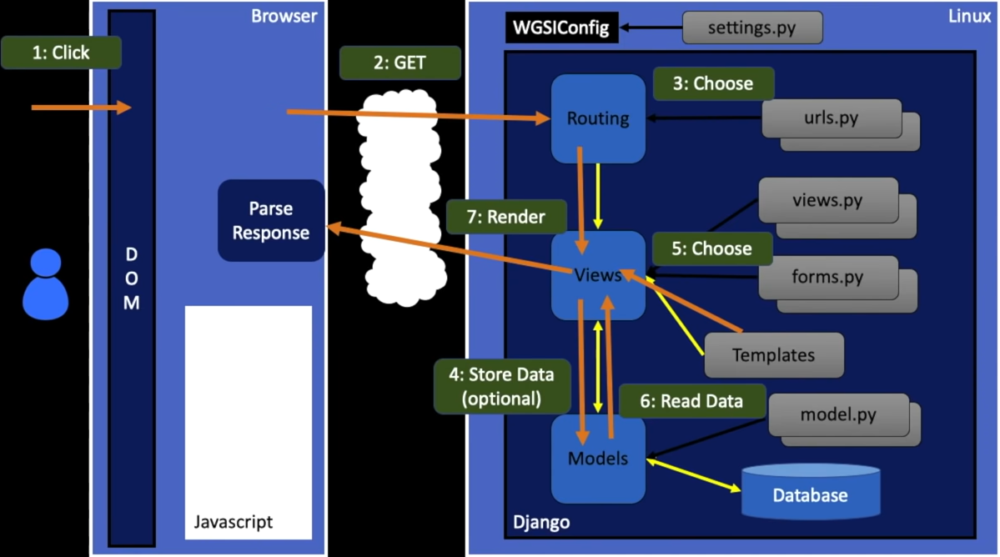

## [Python Django Tutorial for Beginners](https://www.youtube.com/watch?v=rHux0gMZ3Eg)

- **Front-end** (**Client**): is what is loaded inside a browser and what user sees.
- **Back-end** (**Server**): runs on a server and responsible for data processing, validation etc.
- **URL**: Uniform Resource Locator; a way to locate resource on the internet.

- When a user hits a websites, the browser sends a `Request` to the (web) `server`. The server processes the request and sends back a `Response` to the `Client`.

- The data exchange/communication between `Client` and `Server` is defined by **HTTP**.

- To create the back-end, one has to decide how one is going to response to the client. There are two ways:

1. Server generates the Response and return it to the Client. In this case, one generates an `HTML` file and return it to the client.
2. Only generate the data requested on the Server and return it. In this case, the Client will have to generate the HTML page. This is more scalable, meaning more users can be served at once using this approach.

- If one pushed the responsibility to generate the page on the Client, then Server becomes the Gateway for the data. In this scenario, one can provide different endpoint for user to talk to. These endpoints are called `API` (Application Programming Interface).

## [Django For Everybody - Full Python University Course](https://www.youtube.com/watch?v=o0XbHvKxw7Y)

### Introduction to Dynamic Web Content

- The web browser waits for an event to happen, say clicking on the a link on the webpage. That click is intercepted by the browser application which opens a network socket across the network to the web server and sends a request. The web server does what it is supposed to do and then sends back a response on the same socket. This is `request-response cycle`.

### Network Sockets

- URL consists of three things: protocol (like http, https, ftp), host (google, data.pr4r.org etc) and the document name (page1.html).

- **HTTP** (HyperText Tranfer Protocol):

  - Invented for Web - to retrieve HTML, Images, DOcuments, etc
  - Entended to handle data in addition to documents - RSS, Web services, etc.
  - Basic Concept: Make a connection - Request a document, Retrieve the document - Close the connection.

- **Socket** is like a phone call where two computer software talk to each other. Internet is the medium through which the conversation takes place.

### Flow of a Web Request

- When the request arrives at a Django app the incoming request URL is compared to the list of paths in `url.py` in the variable `urlpatterns`.
- When there is a url match, it selects a `View` which is a bit of code that handles any database access and then produces and delivers the response to the browser.
- The `view` access the databse indirectly through an abstraction called a `model`.
- This is a general web pattern called **Model-View-Controller** or **MVC**.

### What goes in the background (in Django)



- User clicks on something in `DOM` (Document Object Model) i.e. in the browser. The browser intercept the click and creates a socket connection across the internet and does a `GET` request. This request goes into the (web) server.
- The three main modules are `routing` , `view`, and `models`. There is `setting.py` file that is like a config file that has information like, this is the view file, models file etc.
- When the request first comes in, it consults `url.py` (for each project or application) and pulls out the `view.py`.
- `view.py` has the destination for the incoming url. We can also use files like `forms.py` and `Templates`.
- In case some data needs to be stored, we use `models.py` to store the data in the database.
- Once that is done, we read the new data from the database and combine that with the template and send a response which the user ultimately sees.

#### Command tracker

- To set up the basic infrastructure

```shell
mkdir django_projects
cd .\django_projects\
# this is to create a project
django-admin startproject mysite
```

- The following to allow all host.

```python
# make the following changes in the setting.py file in the mysite folder
ALLOWED_HOSTS = ["*"]
```

- The following to run the server.

```shell
python .\mysite\manage.py runserver
```

- Create an application

```shell
cd .\mysite\
python .\manage.py startapp polls
```

and open `view.py` file in `polls` folder and add the following:

```python
from django.http import HttpResponse

def index(request):
    return HttpResponse("Hello world, you are the poll index.")
```

Now create a file `urls.py` in `polls` folder and add:

```python
from django.urls import path

from . import views

urlpatterns = [
    path("", views.index, name="index"),
]
```

Now add the following in the `urls.py` in `mysite` folder:

```python
from django.contrib import admin
from django.urls import path, include

urlpatterns = [
    path("admin/", admin.site.urls),
    path("polls/", include("polls.urls")),
]
```

Now, run:

```shell
# to check for errors
python .\manage.py check
python .\manage.py runserver
```

This is display 404 on http://127.0.0.1:8000/. However, add `polls` at the end to see the changes we made so far. http://127.0.0.1:8000/polls

### Creating Table

- Use `model.py` to create the table. Add the following to create a table name 'user':

```python
from django.db import models

class user(models.Model):
   name = models.CharField(max_length=128)
   email = models.CharField(max_length=128)
```

- In the `settings.py` add the following inside `INSTALLED_APPS`:

```python
"polls.apps.PollsConfig",
```

Note that the name of the application is `polls`.

- Then run the following commands:

```shell
python .\manage.py check
python .\manage.py makemigrations
python .\manage.py migrate
```

- Then use `python manage.py makemigrations` to create files. `makemigrations` is used in sandbox or for testing.
- Once all the testing is done, use `python manage.py migrate` to send the data to the database.
